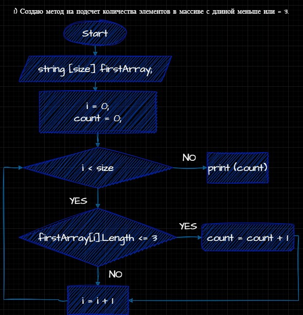
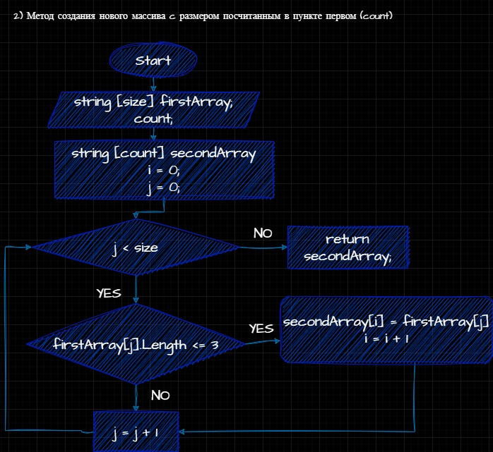

**Задача алгоритмически не самая сложная, однако для полноценного выполнения проверочной работы необходимо:**

1. Создать репозиторий на GitHub

2. Нарисовать блок-схему алгоритма (можно обойтись блок-схемой основной содержательной части, если вы выделяете её в отдельный метод)

3. Снабдить репозиторий оформленным текстовым описанием решения (файл README.md)

4. Написать программу, решающую поставленную задачу

5. Использовать контроль версий в работе над этим небольшим проектом (не должно быть так, что всё залито одним коммитом, как минимум этапы 2, 3, и 4 должны быть расположены в разных коммитах)

Задача: Написать программу, которая из имеющегося массива строк формирует новый массив из строк, длина которых меньше, либо равна 3 символам. Первоначальный массив можно ввести с клавиатуры, либо задать на старте выполнения алгоритма. При решении не рекомендуется пользоваться коллекциями, лучше обойтись исключительно массивами.

*Примеры:
[“Hello”, “2”, “world”, “:-)”] → [“2”, “:-)”]
[“1234”, “1567”, “-2”, “computer science”] → [“-2”]
[“Russia”, “Denmark”, “Kazan”] → []*

План решения задачи:

1. Создаем метод, который считает сколько элементов в первом массиве с длиной меньше или равно 3 символов:

2. Создаем метод, который на вход берет наш первый массив и посчитанное количество элементов из 1го пункта. Проверяем каждый элемент первого массива на длину и если она меньше или равна 3, то записываем строку как элемент второго массива. Размером второго массива служит величина count, посчитанная в 1 пункте.

